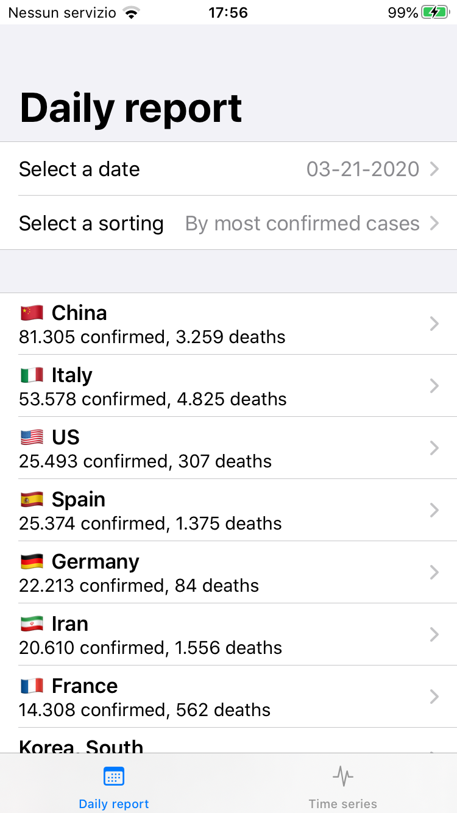
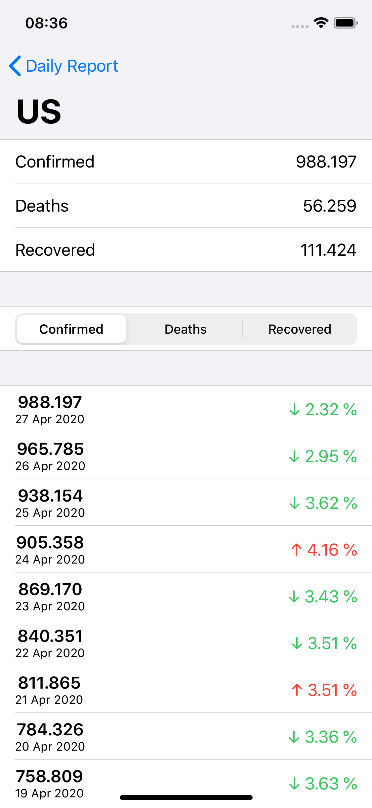

# COVID-19 Stats

This is a sample SwiftUI project that shows COVID-19 data provided by **Johns Hopkins University Center for Systems Science and Engineering (JHU CSSE)**. The official data are available on the official [GiHub repository](https://github.com/CSSEGISandData/COVID-19).

Basically the app allows to display the daily report with confirmed cases, deaths and recovered.

Main features of the app are:

* Ability to show the data for a given date
* Filter the daily reports by confirmed cases, deaths and recovered
* Display data evolution for every country (time series)

## Screenshots

## ToDo

### Improvements and features

* [x] Time series deaths and recovered
* [x] Better detail view in daily report
* [x] Add a loading when data is downloading
* [ ] Refresh data when app is opened from a background status
* [x] Add search bar in the main view
* [x] Select date from the first data available on the remote data

### Code side

* [x] Improve UI with view models or other patterns
* [x] Find a generic way to handle the flags
* [x] Handle properly date selection (not with string objects)
